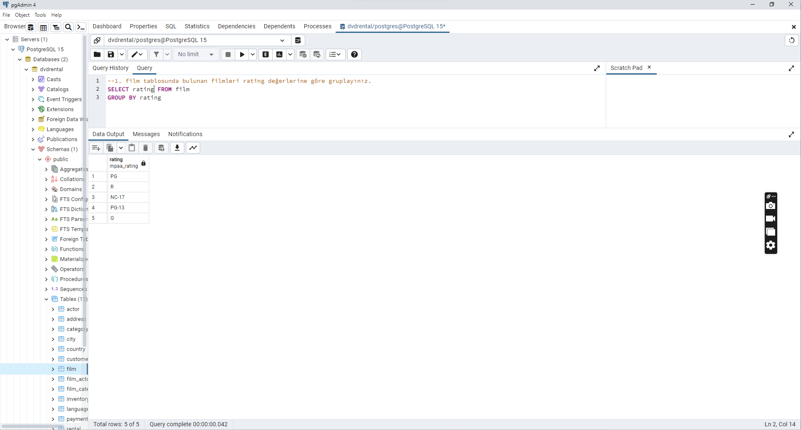
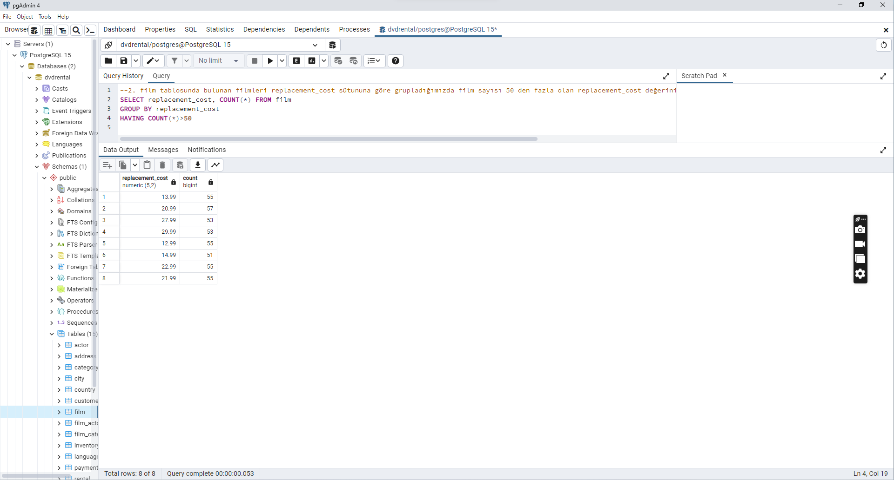
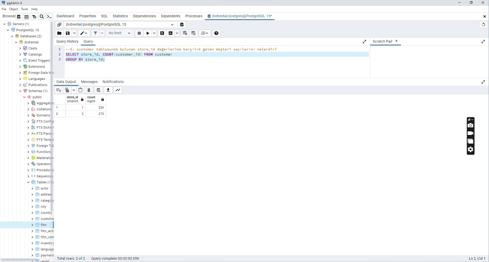
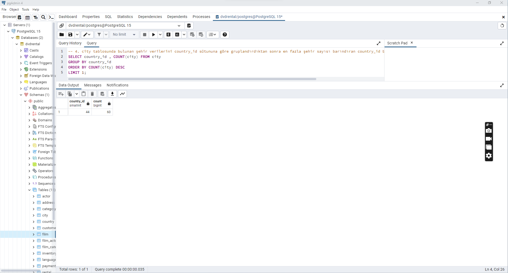

# GROUP BY
Bizler şimdiye kadar olan sorgularımızın tamamında sorguları yaparken genel veri kümesinin tamamı üzerine düşündük, ancak bazı durumlarda aynı sonuçları veri kümesinin içerisinde bulunan farklı gruplarda da bulmak isteyebiliriz. Senaryomuzu şu şekilde düşünelim, dvdrental veritabanında rental_rate sütununda bizim 3 farklı değerimiz var (0.99, 2.99, 4.99). Biz bu 3 farklı değer için en uzun filmi bulmaya çalışalım.

```
SELECT MAX(length) FROM film
WHERE rental_rate = 0.99;
SELECT MAX(length)
FROM film
WHERE rental_rate = 2.99;
SELECT MAX(length)
FROM film
WHERE rental_rate = 4.99;
``` 

İstediğimiz sonuçları elde ediyoruz ancak şöyle bir sorunumuz var 3 farklı değer yerine 30 farklı değer olsaydı? İşte bu şekilde senaryolar için yani verileri gruplama için GROUP BY anahtar kelimesi kullanılır.

## GROUP BY Söz Dizimi

```
SELECT <sütun_adı>, <sütun_adı>, ... (veya aggregate func) FROM <tablo_adı>
GROUP BY <sütun_adı>, <sütun_adı>, ...
```

Burada şuna dikkat etmemiz gerekir, SELECT anahtar kelimesinde bulunan sütunların GROUP BY anahtar kelimesi içerisinde bulunması gerekir.

## GROUP BY Örnek Kullanım
Yukarıdaki senaryomuzu GROUP BY anahtar kelimesini kullanarak gerçekleştirelim. Dikkat ettiğiniz üzere SELECT ile kullanılan rental_rate sütunu GROUP BY satırında da kullanılmıştır.

```
SELECT rental_rate, MAX(length) FROM film
GROUP BY rental_rate;
```
>[](png/img.png)
> 
> 
> 
> 
> 
# HAVING
HAVING anahtar kelimesi sayesinde gruplandırılmış verilere koşullar ekleyebiliriz. Hemen aklımıza WHERE anahtar kelimesi geldi değil mi? Ancak WHERE anahtar kelimesi ile biz satır bazlı koşullar verebiliyoruz.

Şöyle bir senaryomuz olsun. Her bir rental_rate oranına karşılık gelen film sayısını bulalım. Bunu GROUP BY ile gerçekleştirebiliriz. Ancak bu kez 1 adım öteye gidip şöyle bir koşul ekleyelim toplam film sayısı 325 ten fazla olan rental_rate oranlarını görelim. Bu durumda GROUP BY ile elde ettiğimiz toplam film sayılarına koşul eklememiz gerekir.

```
SELECT rental_rate, COUNT(*) FROM film GROUP BY rental_rate HAVING COUNT(*) > 325;
```


[1. film tablosunda bulunan filmleri rating değerlerine göre gruplayınız.](png/1.png)



[2. film tablosunda bulunan filmleri replacement_cost sütununa göre grupladığımızda film sayısı 50 den fazla olan replacement_cost değerini ve karşılık gelen film sayısını sıralayınız.](png/2.png)



[3. customer tablosunda bulunan store_id değerlerine karşılık gelen müşteri sayılarını nelerdir?](png/3.png)



[4. city tablosunda bulunan şehir verilerini country_id sütununa göre gruplandırdıktan sonra en fazla şehir sayısı barındıran country_id bilgisini ve şehir sayısını paylaşınız1](png/4.png)

